```{=latex}
\begin{titlepage}
\center
    {\textbf{UNIVERSIDADE DO ESTADO DE SANTA CATARINA -- UDESC}}
		
    {\textbf{CENTRO DE CIÊNCIAS TECNOLÓGICAS -- CCT}}
		
    {\textbf{PROGRAMA DE GRADUAÇÃO -- BACHARELADO EM CIÊNCIA DA}}
    
    {\textbf{COMPUTAÇÃO}}
		
    \vfill
    
    {\textbf{ANA LUIZA CAPRISTRANO DA CRUZ E GUILHERME HOERNING REINERT}}

    \vfill
    
    {\textbf{\large RELATÓRIO DA TAREFA 1 DE TEORIA DE GRAFOS:}} \\[0.2cm]
    {\large IMPLEMENTAÇÃO DE UM GRAFO COM CARGA PRIMÁRIA DE ARQUIVOS CSV}
    
    \vfill
    \vfill
    
    {\textbf{JOINVILLE}}
    \par
    {\textbf{2026}}
    \vspace{1cm}
\end{titlepage}

\tableofcontents
\newpage
```

## Objetivos da Tarefa

Escrever um código na linguagem C capaz de extrair as os dados inteiros contidos em um arquivo de entrada CSV sob o formato de uma lista de adjacências. O código deverá então criar outra lista de adjacências para interpretar as principais características referentes ao grafo, bem como

1. Número total de vértices;
2. Grau máximo e grau mínimo;
3. Se ele é simples um um multigrafo;
4. Detalhar os componentes conexos existentes, caso houver mais de um, logo a distribuição dos vértices em cada componente, a sua quantidade e tamanhos.

O código deverá ser capaz de ser compilado no Ubuntu e organizado em uma pasta compactada, conforme as especificações de entrega no MOODLE.

## Arquivos CSV de Entrada

Cada arquivo de entrada expressa uma lista de adjacências, ou seja, cada linha do arquivo corresponde a um vértice de um grafo e as suas respectivas adjacências ou conexões com outros vértices, formando assim todas as arestas do grafo.  

O arquivo `teste2.csv` foi disponibilizado pelo professor como principal exemplo de input para o algoritmo, o qual possui 999 linhas com 999 vértices, sendo a primeira linha dedicada para valores de metadados: “100 2”, com 2 denunciando as 2 colunas para a leitura do arquivo, conforme a Figura 1.  

Entretanto, o algoritmo foi criado esperando uma quantidade indeterminada de linhas, vértices e adjacências em um mesmo vértice, portanto qualquer número de colunas. Para tal foi também criado `teste1.csv` contendo a lista de adjacências de um grafo de 5 vértices, significativamente menor e também utilizado como material dedicado à disciplina.  

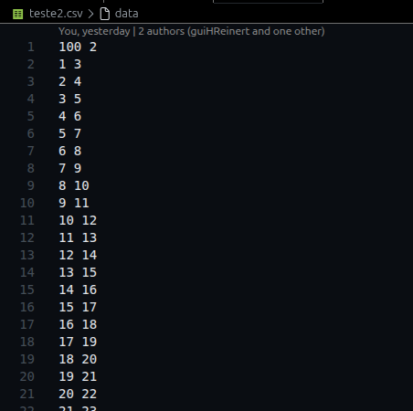{width=50%}

## Estrutura do Código

### Saída e Descrição do Grafo

O arquivo principal de compilação do código é `main.c`. Nele é incluído o *header* principal `arq.h`, que contém todas as bibliotecas e funções utilizadas. Uma vez que a parte mais essencial do algoritmo se localiza em `arq.h`, este arquivo se concentra em declarar as variáveis iniciais e as funções utilizadas para gerar o *output* e detalhamento do grafo. Há também comentários referentes à compilação e uma função opcional `printarListaAdjacencia()` que descreve todas as entradas da lista de adjacência gerada.  

A primeira etapa do código é criar duas variáveis:

- `char* arquivo`: uma string contendo o endereço do arquivo a ser lido;
- `int num_vertices`: inteiro referente ao número total de vértices \+ 1, servindo de limite para a os vetores posteriormente computados.

Ambas são utilizadas pela função `varreduraListaAdjacências()`, que atualiza o valor de `num_vertices` para o input de um arquivo sem antes conhecer o seu tamanho. 

Depois o grafo é criado por `novoGrafo()` e alimentado por `carregarListaAdjacencias()`. As informações mais cruciais, como número de vértices, grau máximo e grau mínimo são mostradas pelo terminal.  

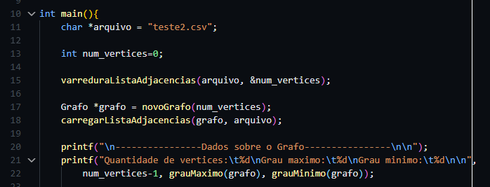{width=80%}

A Figura 3 mostra a função `ehMultigrafo()` e os dois valores inteiros atualizados com a sua chamada, os quais informam a quantidade de laços e arestas múltiplas, respectivamente, no caso do grafo ser um multigrafo.   

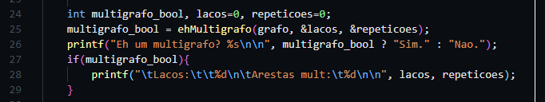{width=80%} 

A Figura 4 mostra a descrição dos componentes conexos composta por 3 variáveis associadas à função `componentesConexos()`:

- `int num_componentes`: quantidade de componentes;
- `int* tamanhos`: quantidade de vértices em cada componente;
- `int** componentes`: matriz contendo a distribuição dos vértices em cada componente.

Naturalmente, por `adicionarAresta()` inserir cada nova aresta de modo ordenado no encadeamento dos vértices, os vértices de cada componente conexo também estarão em ordem crescente.  

Por fins de visualização do grafo completo, criou-se também a função `printarListaAdjacencias()` para apresentar no terminal a lista encadeada com todos os seus vértices separados por colchetes e flechas para simbolizar os blocos encadeados. E uma vez que 999 vértices facilmente poluem a visão do terminal, ela foi comentada para a visualização dos dados mais importantes.  

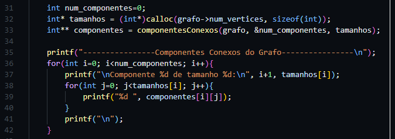{width=80%}

### Funções e Structs Criados

A seguir, serão apresentados o funcionamento e os objetivos das funções implementadas no arquivo `arq.h`, responsável pela maior parte da lógica e das funcionalidades principais do programa.

Na Figura 5 temos as linhas iniciais do arquivo `arq.h`

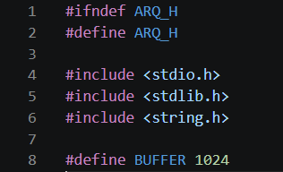{width=40%}

As linhas um e dois, são responsáveis em impedir que o mesmo arquivo `.h` seja incluído mais de uma vez no programa. Nas linhas 4, 5 e 6 temos as bibliotecas utilizadas. Foram carregadas as bibliotecas específicas `stdlib.h` e `string.h**, **stdlib.h` para `malloc**, **calloc**, **free`, entre outras, e `string.h` para `strtok**.* O `define` da linha 8 cria uma constante chamada `BUFFER` com valor 1024 que representa o tamanho máximo do vetor de caracteres usado para leitura das linhas do arquivo.

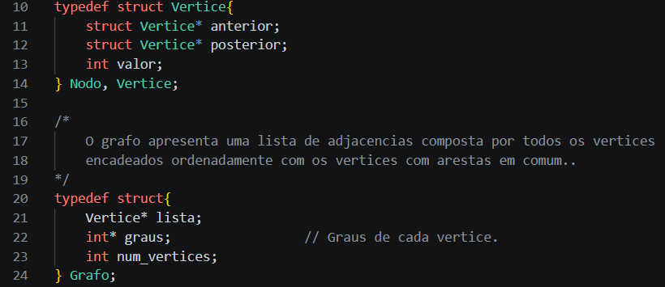{width=80%}

A *struct* `Vértice` representa os vértices e os nós da lista de adjacências do grafo. Há dois ponteiros, um para o elemento anterior e outro para o elemento posterior, e o valor que é utilizado para identificação do vértice. Já o *struct **Grafo` é composto pela lista de adjacências, uma lista contendo os graus de cada vértice (endereço que ajuda na lógica de outras funções) e o número limite de vértices.  

As funções `novoVertice()` e `novoGrafo()` são funções básicas para a alocação de memória de cada struct e seus componentes internos. Em `novoGrafo()`, `lista` é alocada dinamicamente e possui cada vértice seu iniciado com o valor de seu próprio índice, como demanda a estrutura de uma lista de adjacências. A Figura 7 mostra `inserirVertice()` e `inserirAresta()`, logo as principais funções para o encadeamento do grafo. Vale ressaltar que o código trabalha com grafos não-direcionados, ou seja, a aresta recíproca de cada aresta inserida também precisa ser considerada pelas operações que se utilizam da lista de adjacências.

`carregarListaAdjacencias()` e `varreduraListaAdjacencias()` possuem um início similar quanto à leitura do arquivo, porém `varreduraListaAdjacencias()` apenas se encarrega de retornar o maior valor inteiro lido no arquivo (lógica que, para arquivos similares a *teste2.csv*, é o equivalente a ler o total de linhas), logo maior vértice do grafo, a fim de servir como valor limite dos endereçamentos de vetores nas demais funções. Já `carregarListaAdjacencias()` se utiliza do *token* gerado pela função a partir das leituras de cada linha para incluir uma aresta por vez e estruturar o grafo.

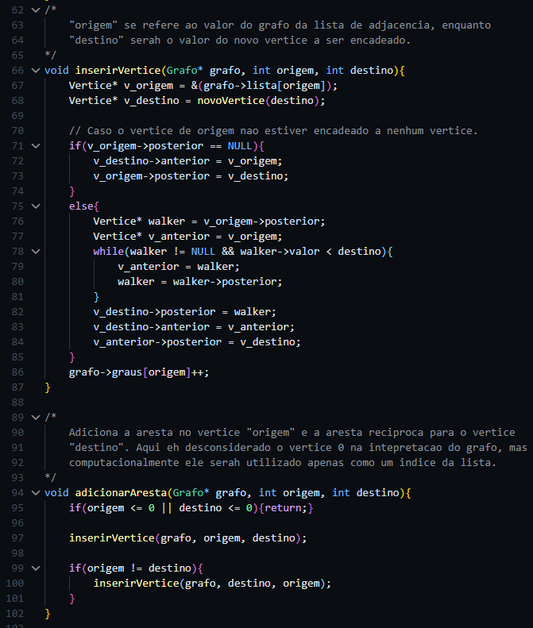{width=70%}

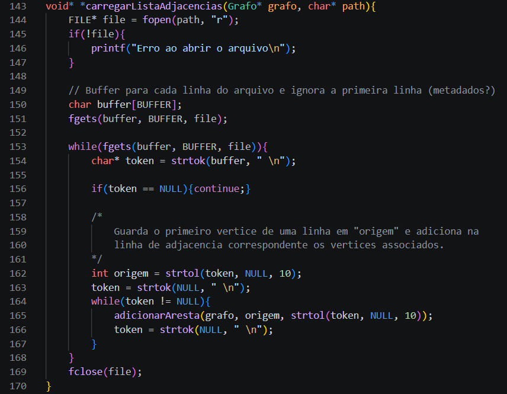{width=70%}

As funções `grauMaximo()` e `grauMinimo()` se utilizam do vetor `graus` em `Grafo` para fazer uma comparação simples e retornar o maior e menor valores do vetor, respectivamente. A função `ehMultigrafo()`  (presente na figura 9\) *é* responsável por verificar se o grafo é simples ou multigrafo. Um multigrafo é aquele que contém laços e/ou arestas múltiplas. Primeiro a função procura laços, que são arestas que se conectam no mesmo vértice, e depois são feitas comparações entre os elementos da lista de adjacências para identificar se há arestas múltiplas, ou seja, conexões repetidas entre dois vértices diferentes. Se forem encontrados laços ou arestas múltiplas, o grafo é classificado como multigrafo.

Para identificar componentes conexos utilizamos a busca em profundidade (DFS), e a função responsável é a `DFS_G()` como mostra na figura 10*,* a partir de um vértice inicial ela percorre todos os vértices conectados a ele, marcando eles como visitados para não haver repetições. Assim é possível separar os vértices de acordo com seus componentes conexos, e determinar a distribuição dos vértices em cada componente, a quantidade total de componentes conexos e o tamanho de cada componente encontrado.

A função `componentesConexos()` (Figura 11\) é responsável por percorrer todos os vértices do grafo e iniciar uma nova DFS sempre que encontra um vértice ainda não visitado. Cada nova execução da DFS representa a descoberta de um novo componente conexo. Durante a busca, os vértices encontrados são armazenados em uma matriz, enquanto um vetor auxiliar registra o tamanho de cada componente identificado.

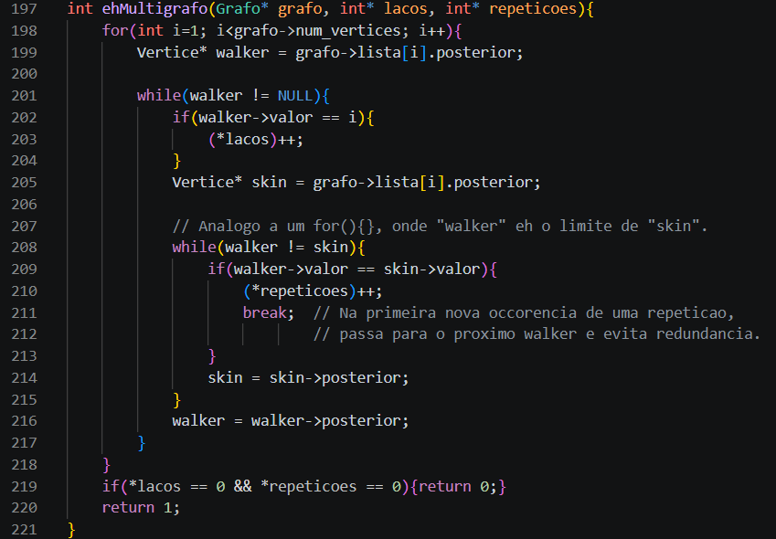{width=80%}

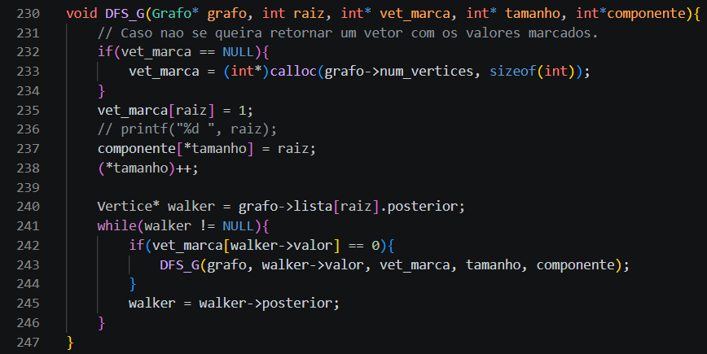{width=80%}

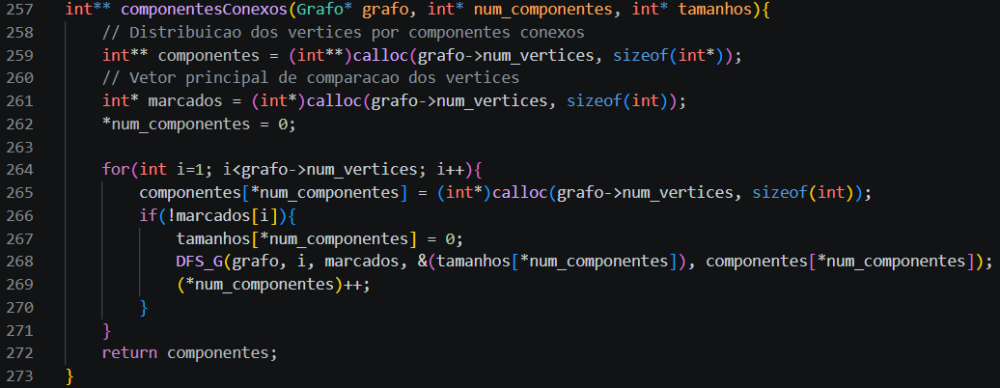{width=80%}

## Dificuldades Encontradas

O enunciado da tarefa explicitava que o arquivo que deveria ser usado de teste e base para o código seria `teste2.csv`, composto por 999 linhas e 2 colunas somente, ou seja, o vértice respectivo à sua linha e apenas uma ou nenhuma adjacência. Até mesmo pela falta de especificação se este deveria ser o *único* arquivo a servir de base, foi-nos auto-imposto o desafio de generalizar os processos que antes seriam exclusivos para este teste para então servir para uma ampla gama de variações: praticamente qualquer número de linhas acima de 0; e linhas com mais de uma adjacência, portanto mais de 2 colunas, sejam laços, arestas múltiplas ou várias adjacências diferentes entre si.  

Esta decisão foi a origem da maioria das dificuldades encontradas, como por exemplo a leitura de uma linha do arquivo por `strtk()` ao invés de outra função que poderia ser mais simples considerando uma quantidade fixa máxima de números para extrair. Ou também as funções `inserirVertice()` e `ehMultigrafo()` que são partidas e preparadas para tratar um número indeterminado de vértices.

Também buscou-se resumir o máximo possível os algoritmos de cada função para que se declarasse o mínimo possível de variáveis, que as declaradas fossem aproveitadas ao máximo, e que fosse aplicada uma lógica simples e rápida. Como esperado, também se consumiu mais tempo aperfeiçoando as funções com base nestes pontos de modo que o código final seja mais “limpo” e direto, com comentários que ajudassem a explicá-lo.

## Resultados

Abaixo segue o resumo dos dados extraídos pelo grafo gerado por `teste2.csv` de *input*, os quais também constam no *output* de `main.c`, como mostra a Figura 11, além de todos os vértices que compõem ordenadamente cada componente:

1. Número de vértices: 999
2. Grau máximo: 2
3. Grau mínimo: 1
4. O grafo é simples, portanto não possui laços ou arestas.
5. O grafo possui 4 componentes conexos, sendo 3 deles com 250 vértices e 1 com 249 vértices (resultando em $3 \times 250+249=999$). O primeiro e quarto componentes possuem vértices ímpares, enquanto os demais possuem vértices pares, e cada um é dividido praticamente nos extremos entre cada quarto na divisão de 1000/4.

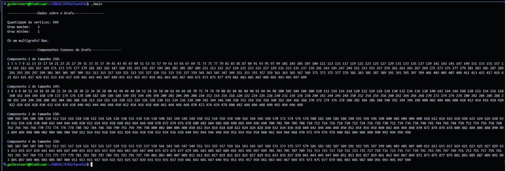{width=80%}

Para facilitar a visualização e análise dos dados obtidos, foi produzido um histograma (Figura 12\) representando os componentes conexos identificados no grafo.   
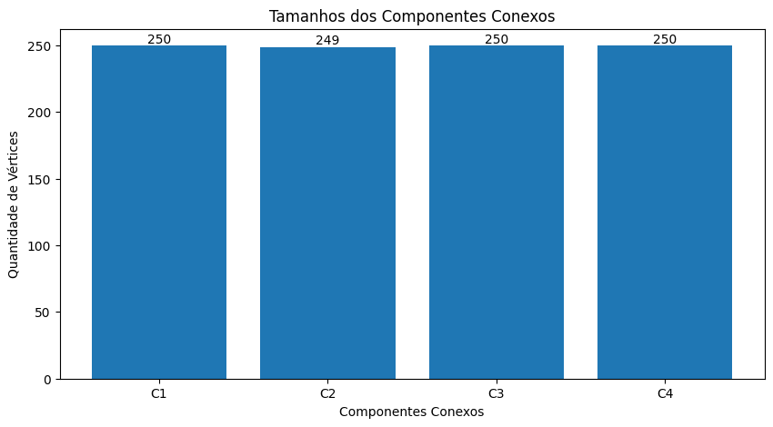{width=80%}
