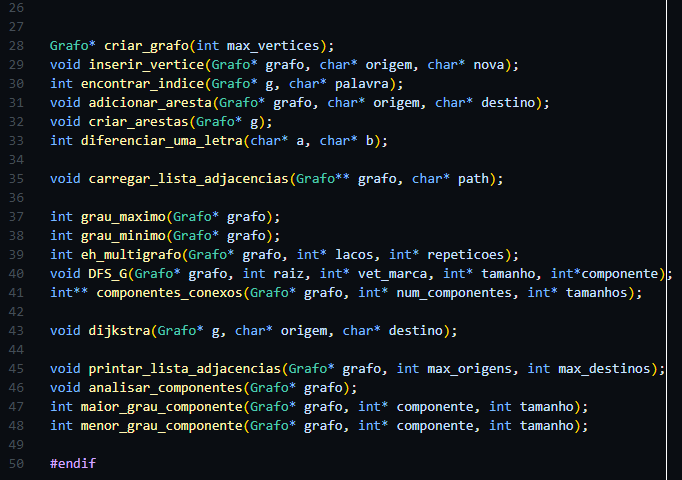
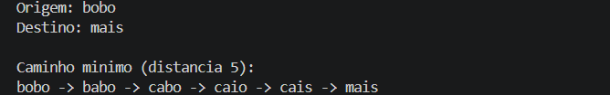
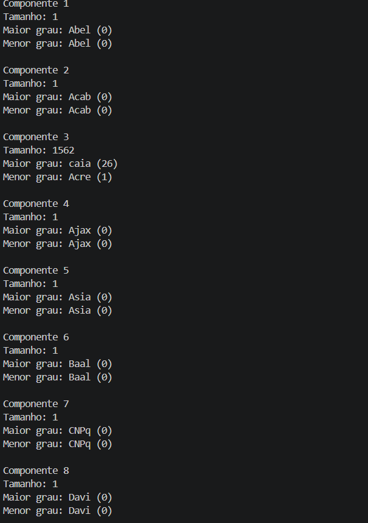
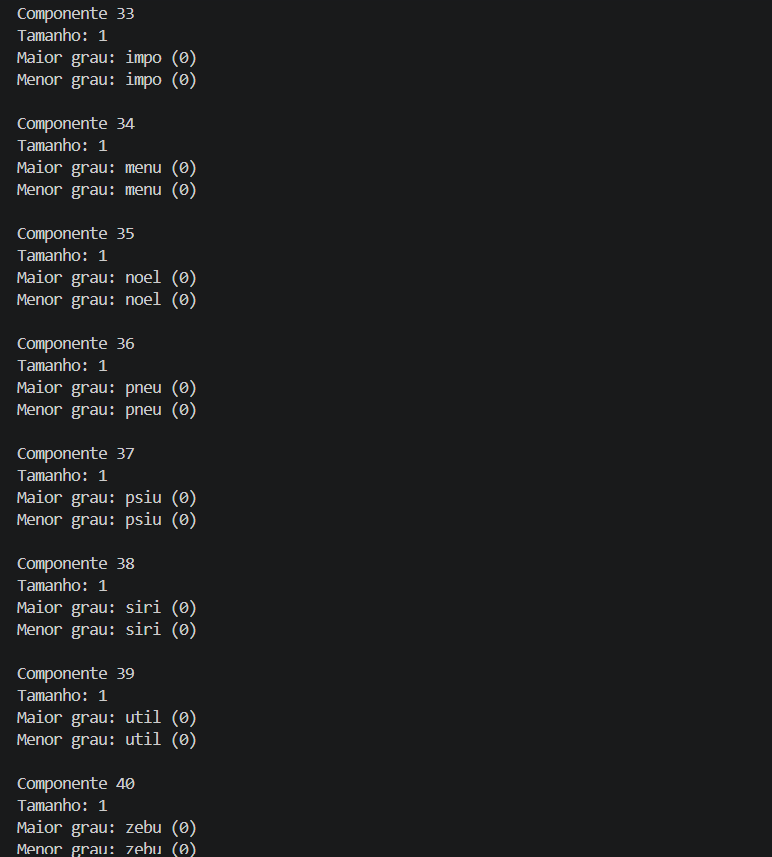

```{=latex}
\begin{titlepage}
\center
	{\textbf{UNIVERSIDADE DO ESTADO DE SANTA CATARINA -- UDESC}}
		
	{\textbf{CENTRO DE CIÊNCIAS TECNOLÓGICAS -- CCT}}
		
	{\textbf{PROGRAMA DE GRADUAÇÃO -- BACHARELADO EM CIÊNCIA DA}}
    		
	{\textbf{COMPUTAÇÃO}}
		
	\vfill
    
	{\textbf{ANA LUIZA CAPRISTRANO DA CRUZ}}
	
	{\textbf{GUILHERME HOERNING REINERT}}

	\vfill

	{\textbf{\large RELATÓRIO DA TAREFA 2 DE TEORIA DE GRAFOS:}} \\[0.2cm]
	{\large IMPLEMENTAÇÃO E ANÁLISE DE UM GRAFO DE PALAVRAS}

	\vfill
	\vfill

	{\textbf{JOINVILLE}}
	\par
	{\textbf{2026}}
	\vspace{1cm}
\end{titlepage}
\tableofcontents
\newpage
```

## Objetivos da Tarefa

Deve-se utilizar um arquivo de texto de base com *N* linhas, cada uma com uma palavra de exatamente 4 letras da língua portuguesa, para a implementação de um grafo não-direcionado ponderado por em um algoritmo da linguagem C. Esta estrutura é conhecida como grafo de palavras, e cada adjacência do grafo relaciona duas palavras quaisquer que tenham somente 1 letra de diferença em qualquer posição da palavra.

Com o grafo criado, pede-se também as seguintes funções de análise e utilização do grafo:

1. Quantidade e tamanho dos componentes conexos existentes;
2. Palavra central de cada componente, logo a com maior número de adjacências, e a palavra com o menor número de adjacências;
3. Se o grafo é simples ou multigrafo (informar a quantidade de laços e arestas múltiplas);
4. Busca do caminho mínimo entre duas palavras quaisquer definidas pelo usuário pelo algoritmo de Dijkstra.

## Arquivo de Entrada

Um arquivo de texto com 1604 linhas contendo 1604 palavras de 4 letras cada, uma palavra por linha, fornecido pelo professor no Moodle da disciplina e nomeado para `palavras_filtradas_4letras.txt`. As palavras estão todas dispostas em ordem alfabética, inicialmente por nomes próprios e acrônimos, e depois por palavras totalmente minúsculas até o fim do arquivo. Não possuem nenhum contexto ou lógica em comum, com exceção de seu tamanho fixo e presença na língua portuguesa.

{width=70%}

## Código e Implementação

O projeto consiste em `palavras_filtradas_4letras.txt`, no *header* `funcoes.h` e nos arquivos C `funcoes.c` e `main.c`.

### *Header* 

`funcoes.h` contém todas as bibliotecas utilizadas: `stdio.h`, `stdlib.h` e `string.h`, pois o grafo depende da manipulação das palavras para a busca, geração de arestas e análise das palavras carregadas, os *structs* e as chamadas das funções de `funcoes.c`. Também é aninhado em uma condicional relacionada à constante `FUNCOES_H` para evitar conflitos de compilação com quaisquer outros *headers* e `BUFFER` para a leitura das palavras.

{width=50%}

### *Structs* 

`Grafo` é composto pela lista de adjacências `lista`, logo um ponteiro de `Vertice`, e pelo número de vértices `num_vertices`. Em `lista`, cada elemento é um vértice diferente do grafo e encadeado com os seus vértices adjacentes. Enquanto `num_vertices` é calculado pelo número de linhas do arquivo carregado.
	
`Vertice` é composto pelo ponteiro `palavra`, pelos valores inteiros `grau` e `valor` e um ponteiro para o primeiro vértice adjacente `listaAdj`. Este último é do tipo `NoAdj` e foi criado como uma estrutura auxiliar e computacionalmente mais barata do que `Vertice`, como foi necessário em certas partes do código e posteriormente detalhado nas dificuldades encontradas.

### Funções

Ambos os arquivos C dependem do mesmo *header*. `funcoes.c` define todas as funções específicas ao projeto para a extração dos dados no arquivo de base, alimentação da lista de adjacências, análise e separação dos componentes conexos, busca pelo caminho mínimo entre duas palavras via Dijkstra e a exportação dos resultados no terminal.  

A Figura 3 expõe as declarações destas funções em `funcoes.h`. Cada “conjunto” de declarações está organizado pelas funções que correspondem à processos similares ou suficientemente independentes dos demais.

{width=50%}

#### Extração de Dados

`carregar_lista_adjacencias()`  abre e lê o arquivo uma vez para contar a quantidade de linhas e criar o grafo. Depois o arquivo é aberto novamente pelo início, por meio da função `rewind()`, e então a lista de adjacências do grafo é carregada pelas palavras no arquivo.

#### Criações e Inserções

`criar_grafo()` é autoexplicativo e aloca dinamicamente todas as propriedades de `Grafo`. `inserir_vertice()` aloca dinamicamente cada vértice e os insere na lista de adjacências de `Grafo` por meio dos índices de cada palavra de entrada `nova`.  

Um índice qualquer de um vértice é gerado por `encontrar_indice()`, responsável por procurar uma palavra no grafo e converter vértices em índices. Essa função é também usada na função principal do trabalho, que é a função `dijkstra().`  

`criar_arestas()` é a responsável pela lógica da criação de arestas do grafo. Quando a função `diferenciar_uma_letra()` é verdadeira, ela adiciona uma aresta através da função `adicionar_aresta(),` ou seja, quando temos dois vértices, cada um deles sendo uma palavra de 4 letras, se há apenas uma letra de diferença entre elas, é adicionado uma aresta que faz a conexão entre os vértices.  

A função `diferenciar_uma_letra()` é utilizada para verificar se duas palavras de 4 letras tem apenas uma letra de diferença entre elas. Exemplo: “ache” e “acho” tem apenas uma letra de diferença, logo a função retornará verdadeiro.

#### Componentes Conexos

A função `eh_multigrafo()` é responsável por verificar se o grafo é simples ou multigrafo. Um multigrafo é aquele que contém laços e/ou arestas múltiplas. Primeiro a função procura laços, que são arestas que se conectam no mesmo vértice, e depois são feitas comparações entre os elementos da lista de adjacências para identificar se há arestas múltiplas, ou seja, conexões repetidas entre dois vértices diferentes. Se forem encontrados laços ou arestas múltiplas, o grafo é classificado como multigrafo.

Para identificar componentes conexos utilizamos a busca em profundidade (DFS), e a função responsável é a `DFS_G()`, a partir de um vértice inicial ela percorre todos os vértices conectados a ele, marcando eles como visitados para não haver repetições. Assim é possível separar os vértices de acordo com seus componentes conexos, e determinar a distribuição dos vértices em cada componente, a quantidade total de componentes conexos e o tamanho de cada componente encontrado.

A função `componentes_conexos()` é responsável por percorrer todos os vértices do grafo e iniciar uma nova DFS sempre que encontra um vértice ainda não visitado. Cada nova execução da DFS representa a descoberta de um novo componente conexo. Durante a busca, os vértices encontrados são armazenados em uma matriz, enquanto um vetor auxiliar registra o tamanho de cada componente identificado.
A função `maior_grau_componente() e menor_grau_componente()` são usadas para denotar, respectivamente, o maior e menor grau de cada componente conexo.

#### Exportação de Dados

`printar_lista_adjacencias()` é uma função criada para o desenvolvimento e basicamente exporta toda a lista de adjacências de modo que fiquem claras as adjacências de todas as palavras do arquivo, que, dado um tamanho grande como 1604 linhas, apenas poluiria a visão do usuário e seria pouco útil. Já `analisar_componentes()` serve para calcular o tamanho de cada componente conexo, identificar os vértices de menor e maior grau de cada componente e exportar essas informações.

#### Algoritmo de Dijkstra

`dijkstra()` é responsável por encontrar o menor caminho entre duas palavras do grafo. O usuário digita a palavra de origem e também a de destino, assim o algoritmo percorre o menor caminho entre elas e printa tanto o caminho quanto o tamanho. Exemplo: para `origem`: “casa” e `destino`: “cama”, a saída será `casa - > cama`, com distância 1. 

## Ambiente e Compilação

Usamos o VSCode tanto para a programação de todo o projeto quanto para a sua execução. A compilação foi testada via GCC no terminal por meio de uma instrução presente no início de `main.c` e recomendada para os usuários. Portanto, dada a simplicidade, o projeto não se restringe à utilização de nenhuma IDE específica e apenas requer um ambiente que execute códigos em C básicos.

## Dificuldades Encontradas

Tivemos que criar a *struct* `NoAdj`, pois estava inviável usar apenas a *struct* `Vertice` para representar as conexões do grafo, já que cada vértice pode ter um número variável de vizinhos, o que tornaria o armazenamento em estruturas fixas ineficientes. Tentamos usar somente a *struct* `Vertice` porém o carregamento ficou muito pesado e demorava muito para executar. Com a *Struct* `NoAdj`**,** conseguimos reduzir o consumo de memória e melhorar o desempenho na construção do grafo. 

## Resultados

Os resultados obtidos foram:

1. Temos um grafo com 1604 vértices, sendo 26 o grau máximo e 0 o grau mínimo;
2. É um grafo simples, ou seja, não é um multigrafo, portanto não possui laços nem arestas múltiplas;
3. Na Figura 4 temos um exemplo usando o algoritmo de Dijkstra, tendo como `origem` a palavra “bobo” e como `destino` a palavra “mais”;
4. O grafo possui 40 componentes conexos.  

{width=70%}

Nas Figuras 5 e 6 temos os primeiros e os últimos componentes e podemos ver seus respectivos tamanhos, a palavra central de cada componente (vértice de grau máximo) e também a palavra com menos conexões (vértice de grau mínimo). Nota-se que apenas um dos componentes conexos possui uma quantidade grande de vértices, enquanto três deles comportam apenas 2 e os demais 1.

Esta grande diferença de distribuição se deu principalmente pelas palavras que representam siglas, como “CNPq”, “IMPA” e “UFRJ”, e em nomes próprios, principalmente aqueles menos comuns na língua portuguesa. Uma vez que cada aresta é formada em uma distância máxima 1 entre duas palavras e a verificação das caixas de cada letra é sensível, portanto uma letra em caixa alta é considerada diferente de uma em caixa baixa, este se torna um fator relevante para a dispersão das palavras que se aproximam destes casos.

{width=50%}

{width=50%}
